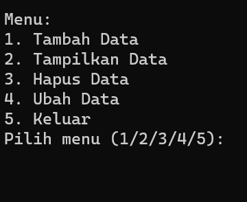

# Praktikum 6
# Pertemuan 11

## Profil
| Variable | Isi |
| -------- | --- |
| **Nama** |Delfyno dwi pastyo |
| **NIM** | 312310480 |
| **Kelas** | TI.23.A.5 |
| **Mata Kuliah** | Bahasa Pemrograman |

## Latihan 1

Ubahlah kode dibawah ini menjadi fungsi menggunakan lambda.

```
import math

def a(x):
return x**2

def b(x, y):
return math.sqrt(x**2 + y**2)

def c(*args):
return sum(args)/len(args)

def d(s):
return "".join(set(s))
```

Penjelasan:
Lambda digunakan di sini untuk membuat fungsi-fungsi singkat dan ekspresif tanpa perlu mendefinisikan fungsi secara terpisah.

- `hitung_kuadrat`: Fungsi lambda untuk menghitung kuadrat dari suatu bilangan x.
- `hitung_miring`: Fungsi lambda untuk menghitung panjang sisi miring dari segitiga siku-siku dengan panjang sisi x dan y.
- `hitung_rata_rata`: Fungsi lambda untuk menghitung rata-rata dari sekumpulan angka yang diberikan sebagai argumen.
- `hapus_duplikat`: Fungsi lambda untuk menghapus duplikat karakter dalam string s dengan menggunakan konsep set dalam Python.

Hasil:


## Tugas Praktikum

Tugas Praktikum

Buat program sederhana dengan mengaplikasikan penggunaan fungsi
yang akan menampilkan daftar nilai mahasiswa, dengan ketentuan:
• Fungsi tambah() untuk menambah data
• Fungsi tampilkan() untuk menampilkan data
• Fungsi hapus(nama) untuk menghapus data berdasarkan nama
• Fungsi ubah(nama) untuk mengubah data berdasarkan nama

• Buat flowchart dan penjelasan programnya

Penjelasan:
- Program utama berjalan dalam sebuah loop yang terus berlanjut. Setiap iterasi dari loop, program akan menampilkan menu pilihan untuk pengguna, kemudian menjalankan fungsi yang sesuai berdasarkan pilihan pengguna.
- Jika pengguna memilih opsi 1, fungsi `tambah()` akan dijalankan untuk menambah data mahasiswa.
- Jika pengguna memilih opsi 2, fungsi `tampilkan()` akan dijalankan untuk menampilkan data mahasiswa.
- Jika pengguna memilih opsi 3, program akan meminta nama mahasiswa yang akan dihapus, kemudian menjalankan fungsi `hapus(nama)`.
- Jika pengguna memilih opsi 4, program akan meminta nama mahasiswa yang akan diubah, kemudian menjalankan fungsi `ubah(nama)`.
- Jika pengguna memilih opsi 5, program akan menampilkan pesan perpisahan dan keluar dari loop.
- Program ini menggunakan loop while True untuk menjaga agar program tetap berjalan hingga pengguna memilih untuk keluar. Program menyediakan antarmuka interaktif sederhana untuk mengelola data mahasiswa.


Berikut Hasilnya:



Tambah Data:
<br>


Lihat Data:
<br>


<br>


Hapus Data:
<br>


Ubah Data:<br>


<br>

Keluar:<br>


Flowchart:<br>


